# NeuroStack AI

[](https://www.python.org/)
[](https://fastapi.tiangolo.com/)
[](LICENSE)

Production-grade **multi-agent AI backend** built with **FastAPI**, **PostgreSQL**, **Redis**, **LangChain**, **ChromaDB**, and **JWT authentication**. REST API for chat, RAG over PDFs, and orchestrated AI agents — ready for portfolios and production deployment.

## Demo

### API overview & health

| Swagger UI | Health check |
|------------|--------------|
|  | 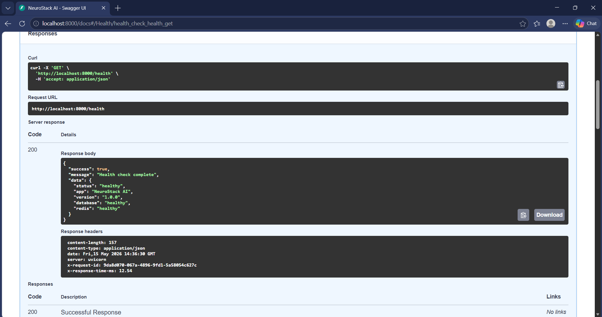 |

### Authentication

| Signup | Login | Authorized session |
|--------|-------|-------------------|
| 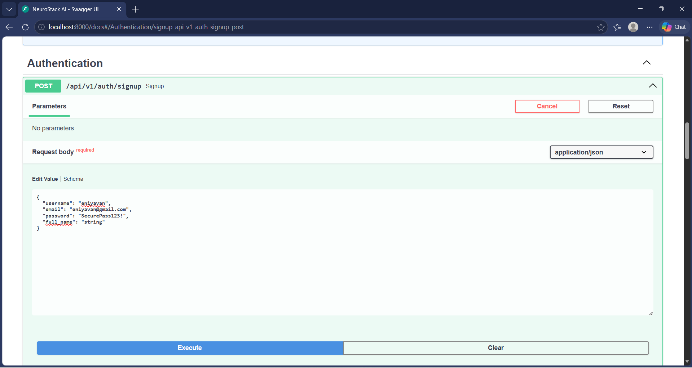 | 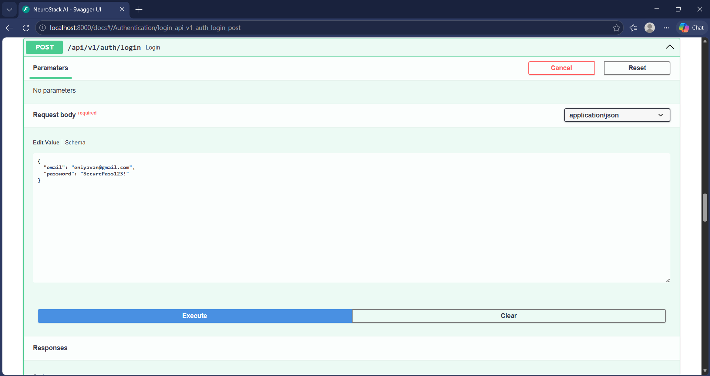 | 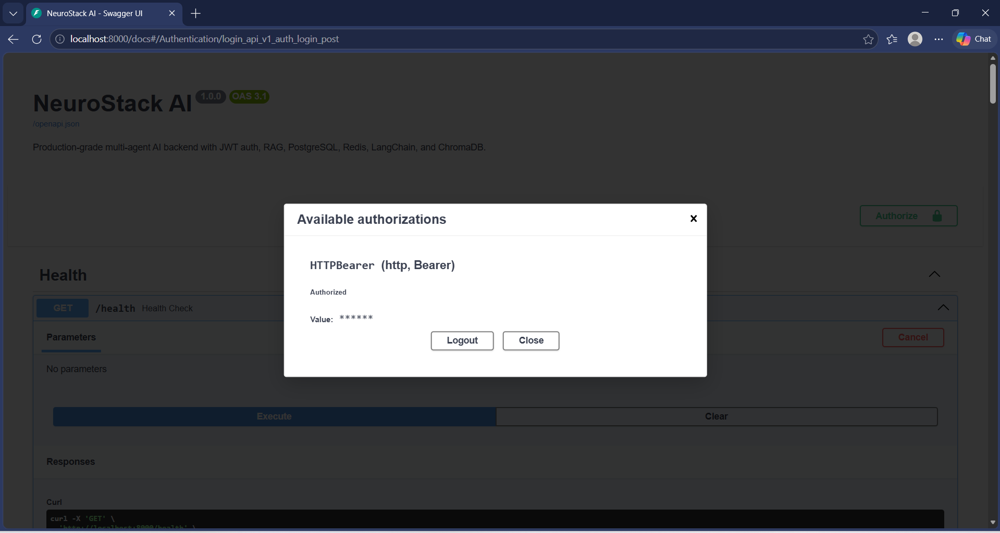 |

### AI chat

| Chat request | Chat response |
|--------------|---------------|
| 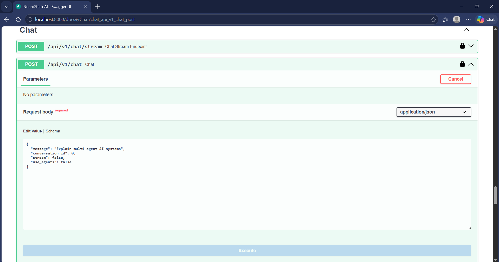 | 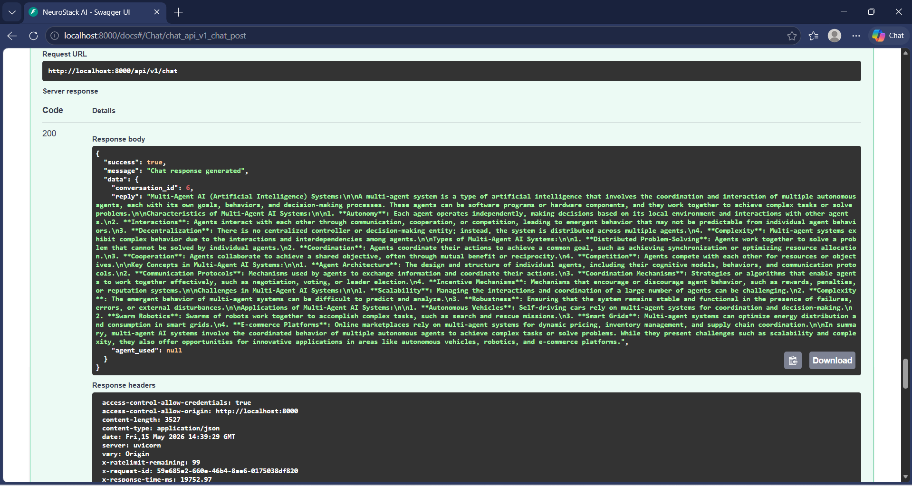 |

### Multi-agent orchestration

| Agent run | Agent output |
|-----------|--------------|
| 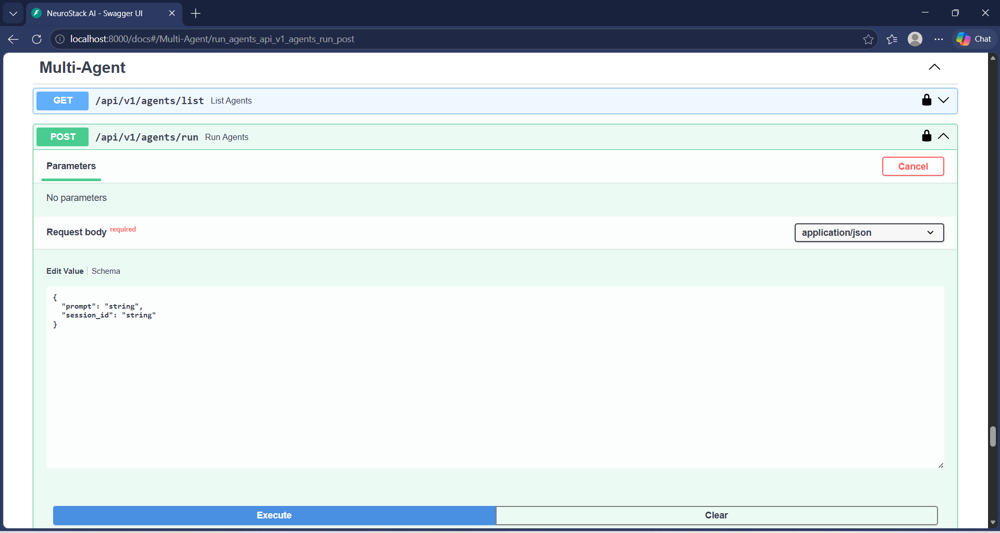 | 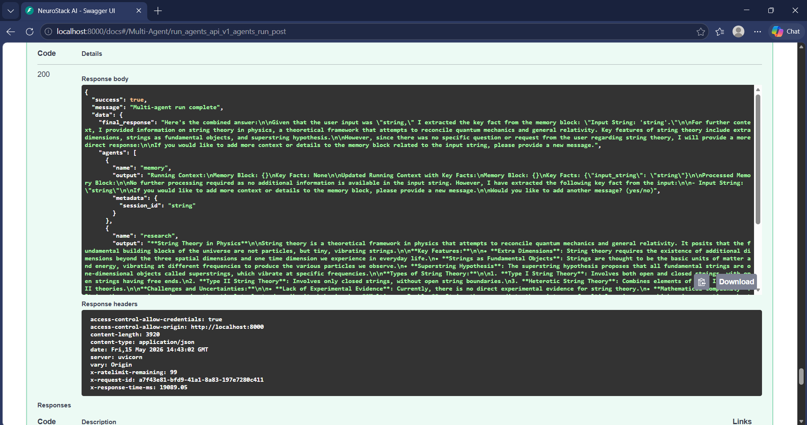 |

### RAG — document upload & Q&A

| PDF upload | Indexed document |
|------------|------------------|
| 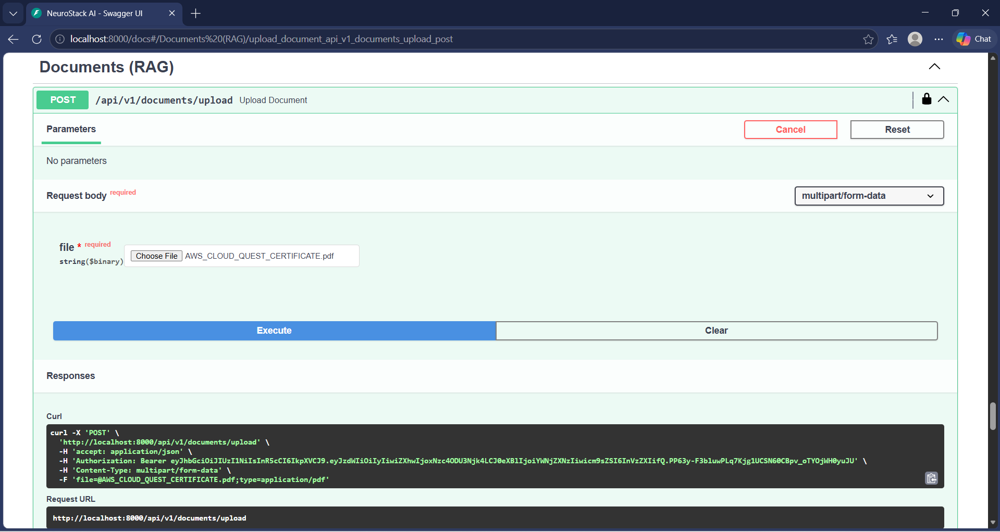 | 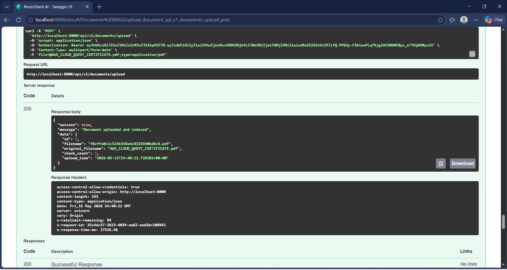 |

| Ask question | Answer from context |
|--------------|---------------------|
| 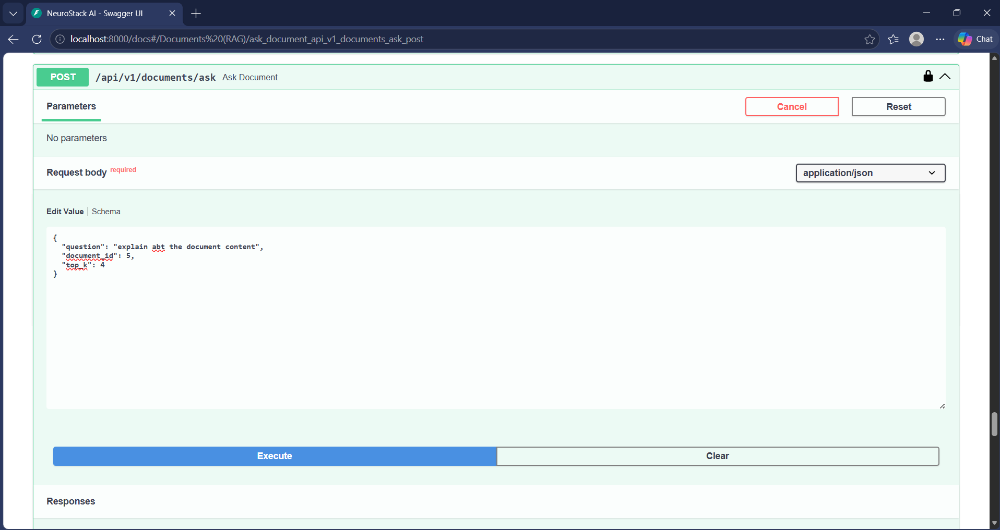 | 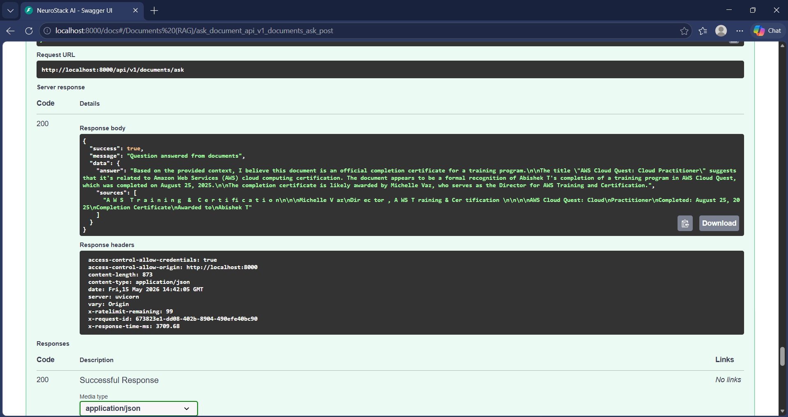 |

## Features

- **JWT Authentication** — signup, login, refresh tokens, role-based access (user/admin)
- **User Management** — profiles, account status, timestamps
- **AI Chat** — conversational AI, streaming (SSE), session memory, PostgreSQL persistence
- **Multi-Agent System** — Research, Summary, Memory, Analytics agents + orchestrator
- **RAG Pipeline** — PDF upload, chunking, HuggingFace embeddings, ChromaDB semantic search
- **Redis** — caching, rate limiting, session/temporary memory
- **Observability** — structured logging, Prometheus `/metrics`, health checks
- **Docker** — one-command `docker-compose up --build`
- **CI/CD** — GitHub Actions test pipeline

## Tech Stack

| Layer | Technology |
|-------|------------|
| API | FastAPI, Uvicorn, Pydantic v2 |
| Database | PostgreSQL, SQLAlchemy 2 (async), Alembic |
| Cache | Redis |
| Auth | JWT (python-jose), bcrypt (passlib) |
| AI | LangChain, OpenAI, Ollama |
| Vectors | ChromaDB, HuggingFace sentence-transformers |
| DevOps | Docker, Docker Compose, GitHub Actions |

## Project Structure

```text
neurostack-ai/
├── app/
│   ├── api/
│   ├── auth/
│   ├── agents/          # Multi-agent orchestration
│   ├── middleware/      # Logging, rate limit, metrics
│   ├── database/
│   ├── models/
│   ├── routers/         # API routes
│   ├── schemas/
│   ├── services/        # Business logic
│   ├── utils/
│   ├── core/            # Config, security, deps
│   └── main.py
├── tests/
├── docker/
├── alembic/
├── requirements.txt
├── docker-compose.yml
└── README.md
```

## Quick Start

### 1. Clone and configure

```bash
cd neurostack-ai
cp .env.example .env
# Edit .env — set SECRET_KEY, OPENAI_API_KEY (or use Ollama)
```

### 2. Run with Docker (recommended)

```bash
docker-compose up --build
```

- API: http://localhost:8000
- Swagger: http://localhost:8000/docs
- Health: http://localhost:8000/health

### 3. Local development (without Docker)

```bash
python -m venv .venv
# Windows: .venv\Scripts\activate
# Linux/Mac: source .venv/bin/activate
pip install -r requirements.txt

# Start PostgreSQL and Redis, then:
uvicorn app.main:app --reload --host 0.0.0.0 --port 8000
```

## Environment Variables

| Variable | Description |
|----------|-------------|
| `DATABASE_URL` | PostgreSQL async URL |
| `SECRET_KEY` | JWT signing secret |
| `OPENAI_API_KEY` | OpenAI API key |
| `REDIS_URL` | Redis connection URL |
| `ACCESS_TOKEN_EXPIRE_MINUTES` | JWT access token TTL |
| `LLM_PROVIDER` | `openai` or `ollama` |
| `OLLAMA_BASE_URL` | Ollama server URL |

See [.env.example](.env.example) for the full list.

## API Examples

### Signup

```bash
curl -X POST http://localhost:8000/api/v1/auth/signup \
  -H "Content-Type: application/json" \
  -d '{"username":"demo","email":"demo@example.com","password":"SecurePass123!"}'
```

### Login

```bash
curl -X POST http://localhost:8000/api/v1/auth/login \
  -H "Content-Type: application/json" \
  -d '{"email":"demo@example.com","password":"SecurePass123!"}'
```

### Chat

```bash
curl -X POST http://localhost:8000/api/v1/chat \
  -H "Authorization: Bearer YOUR_ACCESS_TOKEN" \
  -H "Content-Type: application/json" \
  -d '{"message":"What is a multi-agent system?","use_agents":true}'
```

### Upload PDF (RAG)

```bash
curl -X POST http://localhost:8000/api/v1/documents/upload \
  -H "Authorization: Bearer YOUR_ACCESS_TOKEN" \
  -F "file=@document.pdf"
```

### Ask documents

```bash
curl -X POST http://localhost:8000/api/v1/documents/ask \
  -H "Authorization: Bearer YOUR_ACCESS_TOKEN" \
  -H "Content-Type: application/json" \
  -d '{"question":"Summarize the main points"}'
```

## API Endpoints

| Method | Endpoint | Description |
|--------|----------|-------------|
| POST | `/api/v1/auth/signup` | Register user |
| POST | `/api/v1/auth/login` | Login |
| POST | `/api/v1/auth/refresh` | Refresh token |
| GET | `/api/v1/auth/me` | Current user |
| POST | `/api/v1/chat` | Send message |
| GET | `/api/v1/chat/history` | List conversations |
| DELETE | `/api/v1/chat/history` | Clear history |
| POST | `/api/v1/documents/upload` | Upload PDF |
| POST | `/api/v1/documents/ask` | RAG Q&A |
| GET | `/api/v1/documents/list` | List documents |
| DELETE | `/api/v1/documents/{id}` | Delete document |
| POST | `/api/v1/agents/run` | Run multi-agent pipeline |
| GET | `/health` | Health check |
| GET | `/metrics` | Prometheus metrics |

## Testing

```bash
pip install -r requirements.txt
TESTING=true pytest -v
```

## Deployment

Ready for **Render**, **Railway**, or **AWS EC2**:

1. Set production `APP_ENV=production`, strong `SECRET_KEY`
2. Use managed PostgreSQL and Redis
3. Run: `uvicorn app.main:app --host 0.0.0.0 --port $PORT`
4. Optional: `alembic upgrade head` for migrations

## Architecture

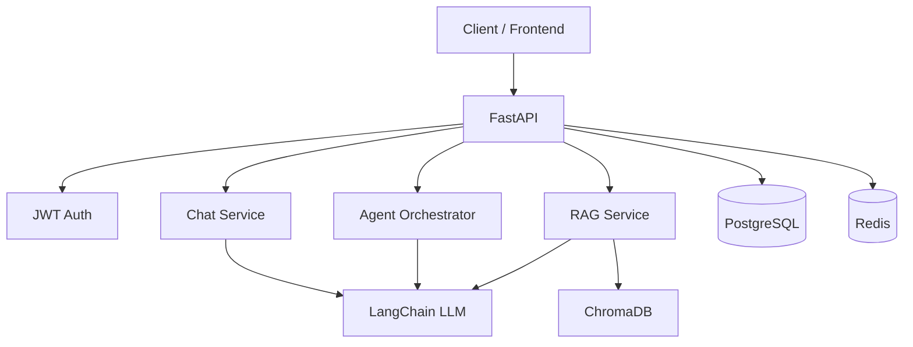

## Future Improvements

- Web search tool for Research Agent
- Kubernetes manifests
- Kafka event streaming
- Frontend React dashboard
- Fine-tuned domain models
- Multi-tenant organizations

## License

MIT — portfolio and educational use.
